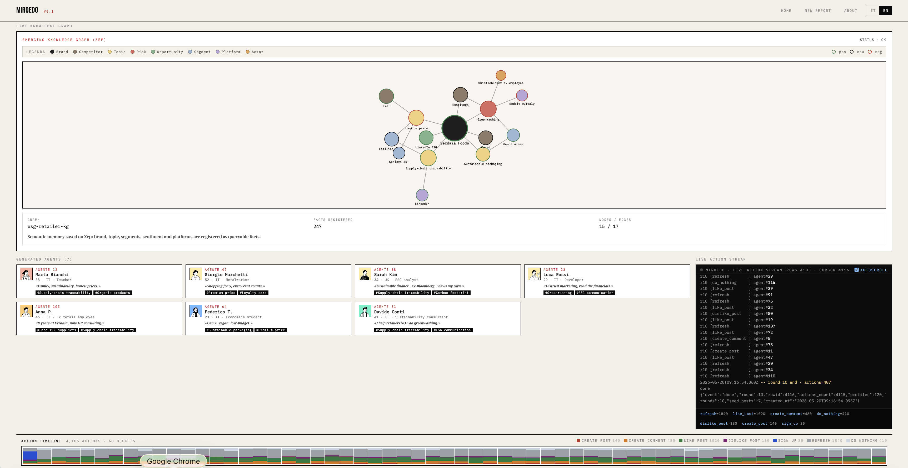

# MiroEdo

> **Italian/English-localized fork of [MiroFish](https://github.com/666ghj/MiroFish)** — brand-perception analytics platform with universal ingestion (CSV/XLSX/PDF/MD), AI-generated report and OASIS-based social simulation.

🔗 **Live demo:** <https://www.edoedoedo.it/experiments/miroedo/>



Status: **end-to-end working** — see the two showcases NordaLatte (crisis-recall) and Verdaia (ESG launch) shipped as static demos from the frontend.

---

## Table of contents

- [1. Quick start](#1-quick-start)
- [2. Architecture](#2-architecture)
- [3. Tech stack](#3-tech-stack)
- [4. Environment variables](#4-environment-variables)
- [5. Local setup](#5-local-setup)
- [5b. Static demo build (no backend)](#5b-static-demo-build-no-backend)
- [6. Paper — MiroEdo: problem, method, results](#6-paper--miroedo-problem-method-results)
    - [6.0 Why this project](#60-why-this-project)
    - [6.1 Problem statement](#61-problem-statement)
    - [6.2 Background: what MiroFish does](#62-background-what-mirofish-does)
    - [6.3 Method: what changes in MiroEdo](#63-method-what-changes-in-miroedo)
    - [6.4 Results](#64-results)
    - [6.5 Limitations](#65-limitations)
    - [6.6 Differentiators vs MiroFish](#66-differentiators-vs-mirofish)

---

# Technical specs

## 1. Quick start

```bash
cd code
cp .env.example .env          # then set at least LLM_API_KEY (Mistral free tier is enough)
docker compose up -d --build
open http://localhost:3000
```

Three main endpoints:

| URL                          | Service          |
| ---------------------------- | ---------------- |
| `http://localhost:3000`      | Next.js frontend |
| `http://localhost:8000`      | FastAPI API      |
| `http://localhost:8000/docs` | OpenAPI Swagger  |

---

## 2. Architecture

```
┌────────────────────────────────────────────────────────────────────┐
│                          USER (browser)                            │
└──────────┬─────────────────────────────────────────────────────────┘
           │  Next.js 15 (React 19 + D3 v7)
┌──────────▼─────────────────────────────────────────────────────────┐
│  miroedo-frontend                                                  │
│   • Upload wizard (CSV/XLSX/PDF/MD)                                │
│   • Live pipeline log + simulation streaming (JSONL tail)          │
│   • Report rendering (markdown + D3 charts + force graph)          │
│   • ReAct chat agent UI (AGENT toggle with tool-call inspector)    │
└──────────┬─────────────────────────────────────────────────────────┘
           │  REST/JSON  (POST /reports, /reports/{id}/simulation, …)
┌──────────▼─────────────────────────────────────────────────────────┐
│  miroedo-backend  (FastAPI · Python 3.11)                          │
│   ┌──────────────┐  ┌──────────────┐  ┌──────────────────────────┐ │
│   │  ingestion   │→ │   pipeline   │→ │  postprocess (report)    │ │
│   │  (universal  │  │  (BrandSeed) │  │  • KPI extraction        │ │
│   │   adapter)   │  │              │  │  • Driver bridge         │ │
│   └──────────────┘  └──────┬───────┘  │  • Prospective scenarios │ │
│                            │          │  • Holt-Winters forecast │ │
│                            │          │  • AI-inferred ontology  │ │
│                            │          │  • Chat agent (ReAct, 6  │ │
│                            │          │    tools incl. Zep+OASIS)│ │
│                            │          └──────────────────────────┘ │
│   ┌────────────▼──────────────┐                                    │
│   │  engine/simulation/oasis  │                                    │
│   │   • profile generator     │ ───── camel-ai ──→ Groq / OpenAI   │
│   │   • OASIS minimal runner  │       (per-agent LLM reactions)    │
│   │   • bootstrap engagement  │                                    │
│   └───────────────────────────┘                                    │
│                                                                    │
│   llm/catalog.py: multi-provider factory (Mistral/Groq/OpenAI)     │
└────────┬───────────────────────────────────────────────────────────┘
         │
         ├──→  Mistral API   (ingestion, ontology, report)
         ├──→  Groq API      (OASIS reactions, optional chat agent)
         ├──→  OpenAI API    (optional, OpenAI-compat tier)
         └──→  Zep API       (persistent graph memory, optional)
```

**Canonical data flow** (full run):

1. User uploads a file → `POST /reports` (multipart) → background job
2. Universal adapter (`backend/app/ingestion/`) → `BrandSeed` struct (Pydantic)
3. Pipeline (`backend/app/pipeline.py`):
    - KPI extraction from the seed
    - driver bridge (sentiment + sample quote for critical topics)
    - prospective scenarios (best/base/worst, probability + early signals)
    - mention volume forecast (Holt-Winters)
    - AI-inferred stakeholder ontology via LLM
    - final markdown rendering
4. (Optional) `POST /reports/{id}/simulation` → OASIS simulation in background
5. (Optional) `POST /reports/{id}/chat/agent` → ReAct chat with 6 tools

---

## 3. Tech stack

| Layer         | Technology                                            | Minimum version                |
| ------------- | ----------------------------------------------------- | ------------------------------ |
| Frontend      | Next.js                                               | 15.x                           |
|               | React                                                 | 19.x                           |
|               | TypeScript                                            | 5.x (strict)                   |
|               | D3                                                    | 7.x                            |
| Backend       | FastAPI                                               | 0.115+                         |
|               | Python                                                | **3.11** (oasis requires 3.11) |
|               | Pydantic                                              | 2.x                            |
| Simulation    | [OASIS](https://github.com/camel-ai/oasis) (camel-ai) | upstream                       |
| LLM SDK       | `mistralai`, `groq`, `openai` (OpenAI-compat)         | latest                         |
| Social memory | [Zep](https://www.getzep.com/)                        | optional                       |
| Container     | Docker Compose                                        | v2                             |

**Tested LLM models** (see [code/backend/app/llm/catalog.py](./code/backend/app/llm/catalog.py)):

| ID                        | Provider | Typical run cost | Notes                        |
| ------------------------- | -------- | ---------------- | ---------------------------- |
| `open-mistral-nemo`       | Mistral  | $0 (free tier)   | **default** ingestion/report |
| `mistral-large-latest`    | Mistral  | ~$0.10           | higher quality               |
| `llama-3.1-8b-instant`    | Groq     | $0 (free tier)   | fast, low OASIS quality      |
| `llama-3.3-70b-versatile` | Groq     | $0 (free tier)   | **recommended** for OASIS    |
| `gpt-4o-mini`             | OpenAI   | ~$0.05           | requires OpenAI API key      |

---

## 4. Environment variables

File `code/.env` (see `.env.example` for the full template):

```dotenv
# === Main LLM (ingestion + report) ===
LLM_API_KEY=...                          # Mistral free key
LLM_BASE_URL=https://api.mistral.ai/v1
LLM_MODEL_NAME=open-mistral-nemo

# === Additional providers (optional, enable extra models in the UI dropdown) ===
GROQ_API_KEY=gsk_...                     # Groq free
OPENAI_API_KEY=sk-...                    # OpenAI, or Groq via base_url redirect
OPENAI_BASE_URL=https://api.groq.com/openai/v1

# === OASIS simulation ===
MIROEDO_ENABLE_SIMULATION=true
MIROEDO_OASIS_LLM_REACTIONS=true         # false = scripted only, true = LLM per agent
MIROEDO_OASIS_MODEL=llama-3.3-70b-versatile
MIROEDO_OASIS_LLM_SAMPLE=0.8             # fraction of agents/round that uses LLM
MIROEDO_OASIS_LLM_MAX_CALLS=1500         # global cap (rate limit safety)

# === Zep (persistent graph memory, optional) ===
ZEP_API_KEY=z_...                        # if missing, Zep tools degrade to "skipped"
```

All `MIROEDO_OASIS_*` variables control simulation behavior and cost. Increasing `LLM_SAMPLE` and `LLM_MAX_CALLS` produces livelier conversations but more API calls (and time).

---

## 5. Local setup

### Prerequisites

- Docker + Docker Compose v2
- ~2 GB free RAM (the backend loads camel-ai + oasis)
- Mistral API key (free at <https://mistral.ai>) **required** for ingestion

### Commands

```bash
git clone <repo> miroedo
cd miroedo/code

# 1. Configure
cp .env.example .env
# edit .env: minimum LLM_API_KEY

# 2. Build + run
docker compose up -d --build

# 3. Tail logs (optional)
docker compose logs -f miroedo-backend

# 4. Stop
docker compose down
```

### Smoke test

```bash
curl http://localhost:8000/llm/models | jq
# → list of available models (status "ok" if the key is present)

curl -X POST http://localhost:8000/reports \
     -F "file=@seeds/verdaia_esg_mentions_2026Q1.csv" \
     -F "scenario_brief=Verdaia, brand FMCG italiano, lancio linea biologica ESG-positioned Q1 2026."
# → {"run_id": "...", "status": "starting"}
```

### Recommended run configuration

After many attempts, this is the setup that produces lively conversations at zero cost:

| Parameter                  | Recommended value         | Why                                                  |
| -------------------------- | ------------------------- | ---------------------------------------------------- |
| OASIS agents               | **40**                    | Enough diversity, manageable free-tier rate limit    |
| Rounds                     | **4**                     | Beyond 4 rounds the sim saturates on `refresh`       |
| `MIROEDO_OASIS_MODEL`      | `llama-3.3-70b-versatile` | Groq free tier, reliable tool-use                    |
| `MIROEDO_OASIS_LLM_SAMPLE` | `0.8`                     | 80% of agents/round use LLM, 20% scripted            |
| Ingestion + report         | `open-mistral-nemo`       | Mistral free tier, good quality for Italian markdown |

Expected end-to-end time: **~25 minutes**. Cost: **$0**. If you have an OpenAI or Mistral Large key you can swap models from the UI dropdown without touching the code.

### Bundled sample datasets

Two ready-to-use showcases, already loaded as static demos in the frontend and available as seeds for real backend runs:

| File                                    | Showcase       | Context                                                                   |
| --------------------------------------- | -------------- | ------------------------------------------------------------------------- |
| `seeds/verdaia_esg_mentions_2026Q1.csv` | **Verdaia**    | Italian FMCG, organic ESG line launch — 50 mentions, 14 columns           |
| `seeds/nordalatte_recall_brief.pdf`     | **NordaLatte** | Dairy crisis-recall: a PDF brief from which the adapter extracts the seed |

The same two brands are clickable as demos from the frontend home (simulation replay + already-generated report, no backend required).

---

## 5b. Static demo build (no backend)

The frontend can be exported as a fully static site (no Node, no FastAPI) that replays the bundled showcases — handy for portfolio hosting on a shared server like Aruba, GitHub Pages or any S3-compatible bucket.

```bash
cd code/frontend
NEXT_PUBLIC_DATA_SOURCE=mock npm run build
# → output in code/frontend/out/

# Local preview
python3 -m http.server 5173 --directory out
open http://localhost:5173/
```

### Deploy under a sub-path (e.g. `https://example.com/experiments/miroedo/`)

The Next.js config reads `NEXT_PUBLIC_BASE_PATH` to rewrite asset URLs:

```bash
NEXT_PUBLIC_DATA_SOURCE=mock \
  NEXT_PUBLIC_BASE_PATH=/experiments/miroedo \
  npm run build
```

Then upload the contents of `out/` to the target folder via FTP / rsync. A ready-to-use `.htaccess` for Apache (Aruba shared hosting) is shipped in [code/frontend/.htaccess](./code/frontend/.htaccess) — it handles SPA-style fallback, cache headers and gzip.

---

# Paper

## 6. Paper — MiroEdo: problem, method, results

### 6.0 Why this project

MiroEdo is a personal portfolio project with three concrete motivations:

1. **Generalization from a Chinese vertical to a multi-language / multi-source platform** — the MiroFish baseline is hardcoded for the Chinese market (MindSpider crawler over Weibo/Zhihu, prompts in 中文). I wanted to verify whether the same architecture — deep-research multi-engine + OASIS social simulation — could work on any social-listening export (CSV, XLSX, PDF, MD) uploaded by the user, with bilingual IT/EN prompts and UI.
2. **Zero cost as a design constraint, not a fallback** — most AI portfolio projects assume paid OpenAI/Anthropic tiers. MiroEdo is designed to run end-to-end on the Mistral free tier (ingestion + report) and the Groq free tier (OASIS reactions on Llama 70B). A full run of 40 agents × 4 rounds costs **$0**. The same code runs on GPT-4o/Claude if the key is configured: the provider is a runtime choice, not an architectural assumption.
3. **Original contribution to OASIS** — the 3 runner patches (max_iteration=5, removing DO_NOTHING, bootstrap engagement) are the result of iterative debugging to understand why the upstream sim degraded into `refresh`/`do_nothing`. They are documented in §6.3 and reproducible.

### 6.1 Problem statement

Commercial **brand perception analytics** tools produce reports that describe the _past_: mention volume, average sentiment, top hashtags, top influencers. They leave three needs of brand managers uncovered:

1. **Strategic frame**: raw data does not answer the question "_what would happen if we launched X?_". You need prospective scenarios, not just historical dashboards.
2. **Stakeholder modelling**: aggregated sentiment does not distinguish between a "Milanese family complaining about price" and a "Fridays For Future activist accusing of greenwashing". You need typed entities, not just counts.
3. **What-if simulation**: before a real launch, it would be useful to observe a plausible synthetic conversation about that launch. No commercial tool does this.

MiroEdo addresses the three points by combining a **universal adapter** (any tabular export or document becomes input), an **LLM report engine** (ontology + drivers + scenarios + forecast) and an **agent-based social simulation** (OASIS).

### 6.2 Background: what MiroFish does

[MiroFish](https://github.com/666ghj/MiroFish) (Wuhan University, 2024) is the baseline. Architecture: 4 parallel engines (Insight/Media/Query/Forum) producing deep-research reports on a Chinese brand, plus a final ReAct chat agent backed by persistent Zep memory and OASIS simulation. LLMs: GPT-4/Claude tier. Pipeline on Python 3.11.

Strengths: very high conversation quality (GPT-4 excels at tool-use), cross-run graph memory, 120 simulated agents by default.

Limits: $2-5 per run, Chinese market/language, ingestion requires the proprietary MindSpider dataset, no universal UI for user files.

### 6.3 Method: what changes in MiroEdo

**M1. Universal data adapter**
Replaced the MindSpider crawler with a single adapter in `backend/app/ingestion/` accepting CSV, XLSX, PDF, MD, TXT and normalizing them into a `BrandSeed` Pydantic schema (segments, topics, timeline, sentiment_breakdown, knowledge_graph). Works out of the box on real social-listening tool exports.

**M2. Multi-provider LLM catalog**
`backend/app/llm/catalog.py` exposes a `make_llm_client(model_id)` factory that instantiates the right client (Mistral/Groq/OpenAI) by reading env vars. All providers speak the OpenAI-compat schema, so a single `MistralClient` class (alias `LLMClient`) handles the calls. The UI exposes a "LLM Model" dropdown loaded from `GET /llm/models`, showing only the models whose key is configured.

**M3. IT/EN-localized report engine**
All postprocess prompts are in Italian. The AI-inferred ontology produces context-aware entities (e.g. on a Lombard utility run: `Family`, `GenZmillennial`, `Pmi`, `Competitor`, `MediaOutlet`, `Influencer`) instead of generic types.

**M4. OASIS minimal runner + 3 architectural patches**
Replaced the parallel OASIS runner from MiroFish (requires IPC, Redis, multi-platform) with a single-process minimal runner in `backend/app/engine/simulation/oasis_runner.py`. Three patches over upstream OASIS turned out to be **necessary** to obtain lively conversations:

| Patch                            | What it does                                               | Measured effect (reference run)                     |
| -------------------------------- | ---------------------------------------------------------- | --------------------------------------------------- |
| `max_iteration = 5`              | Multi-step ReAct loop (refresh→observe→decide→act)         | Unlocks action tool calls                           |
| Remove `DO_NOTHING` from toolset | Takes away the convenient escape hatch for the model       | The LLM must pick a concrete action                 |
| Bootstrap engagement (round 0.5) | Each non-seed agent does 1 manual random like on the seeds | Feed has `score>0` → the LLM perceives live content |

With all three active + a sufficient model (Llama 3.3 70B on Groq), the sim produces `create_post`, `create_comment`, `dislike_post` with in-character content; without the patches everything degrades to `refresh`/`do_nothing`.

**M5. Frontend with interactive tooltips**
All D3 charts in the report ([TimelineForecastChart](./code/frontend/components/TimelineForecastChart.tsx), [TopicTreemap](./code/frontend/components/TopicTreemap.tsx), [GroupBarChart](./code/frontend/components/GroupBarChart.tsx), [SentimentDonut](./code/frontend/components/SentimentDonut.tsx), [ForceGraphSVG](./code/frontend/components/ForceGraphSVG.tsx)) share a `useChartTooltip` hook + a [ChartTooltip](./code/frontend/components/ChartTooltip.tsx) component. The knowledge graph also adds neighbor hover-highlight.

### 6.4 Results

Reproducible metrics from a run on the **Verdaia showcase** (`seeds/verdaia_esg_mentions_2026Q1.csv`, 50 mentions, Q1 2026) with the recommended configuration (40 agents × 4 rounds, Llama 3.3 70B on Groq, 2026-05-24).

| Indicator                           | Value                                       | Why it matters                                                     |
| ----------------------------------- | ------------------------------------------- | ------------------------------------------------------------------ |
| End-to-end time                     | ~25 min                                     | ingestion + report + 4 simulation rounds, free-tier rate limit     |
| Total API cost                      | **$0**                                      | Mistral + Groq free tier, no paid key required                     |
| Spontaneous LLM posts               | 7 (on top of seeded posts)                  | the LLM actively creates content, not just reacts                  |
| Spontaneous LLM comments            | 25, with cross-agent quoting                | real threading: agents reply to each other, not only to seed posts |
| Polarized dislikes                  | 6                                           | the sim does not collapse into bland agreement                     |
| Topics emerged _not_ in input       | _organic supply chain_, _greenwashing_, etc | the LLM autonomously expands the brand's semantic field            |
| Profile-coherent IT/EN bilingualism | ✅                                          | each persona sticks to the language declared in its profile        |

A separate qualitative run on a real social-listening export (a Lombard utility, 3,163 mentions over 365 days, not bundled for licensing reasons) confirmed the same patterns at larger scale.

### 6.5 Limitations

1. **Throughput bound by free-tier rate limit**: Groq free 30 req/min on the 70B → 100+ agents × 5+ rounds = 30+ min. Mitigation: upgrade tier or switch to Anthropic.
2. **Linear Holt-Winters forecast**: a negative trend projects volume to zero in 4 weeks. Replaceable with ARIMA/Prophet but not implemented.
3. **Zep disabled by default**: the "persistent cross-run memory" differentiator from MiroFish is not available without a paid account. The related chat-agent tools (`quick_search`, `panorama_search`, `insight_forge`) gracefully return `skipped`.
4. **Saturating reaction rounds**: after 3-4 rounds agents tend to only do `refresh`. Realistic but reduces the "wow factor" on long demos.
5. **OPENAI_API_KEY as Groq passthrough**: camel-ai requires a variable named `OPENAI_API_KEY` to use OpenAI-compat providers. This is a library choice, not a MiroEdo design issue, but it can be confusing.

### 6.6 Differentiators vs MiroFish

| Capability                  | MiroFish                | MiroEdo                                                                                                    |
| --------------------------- | ----------------------- | ---------------------------------------------------------------------------------------------------------- |
| Native language             | EN / 中文               | **IT / EN**                                                                                                |
| Cost per run                | ~$2-5                   | **$0** (Mistral+Groq free tier)                                                                            |
| LLM provider                | Hardcoded OpenAI/Claude | **Multi-provider plug-and-play**                                                                           |
| Ingestion                   | MindSpider crawler      | **Universal adapter** (CSV/XLSX/PDF/MD)                                                                    |
| OASIS bootstrap engagement  | ❌                      | ✅ (custom patch)                                                                                          |
| OASIS ReAct multi-step      | ❌ (default max_iter=1) | ✅ (custom patch)                                                                                          |
| Interactive report tooltips | ❌                      | ✅ (5 charts + force graph)                                                                                |
| Knowledge graph             | ✅ (GraphRAG + Zep)     | ✅ re-rendered as an interactive D3 force-directed graph in the frontend report (neighbor hover-highlight) |
| Zep graph memory            | ✅ (paid)               | ⚠️ disabled by default                                                                                     |

MiroEdo is a **showcase project**: it starts from MiroFish and rewrites the parts that make it accessible and runnable at zero cost. It is **LLM-provider-agnostic** — the same code runs with GPT-4o, Claude, Mistral Large or free Llama 70B depending on the configured key, so absolute conversational quality depends on the chosen model, not on the pipeline. The knowledge graph, the ReAct chat agent and the OASIS simulation already exist in MiroFish; what MiroEdo adds on top is:

- **Accessibility** — native IT/EN language, universal ingestion of any tabular/document export (replacing the China-only MindSpider crawler), end-to-end runs at $0 on free tiers (Mistral + Groq) without changing a line of code.
- **Architectural rigor** — the 3 OASIS patches (max_iteration=5, removing `DO_NOTHING`, bootstrap engagement) are a documented original contribution, necessary to avoid the `refresh`/`do_nothing` degradation observed upstream.
- **Interactive frontend** — the report charts and the force-directed knowledge graph are re-rendered client-side in D3 with shared tooltips and hover-highlight (presentation layer, not a new capability).
